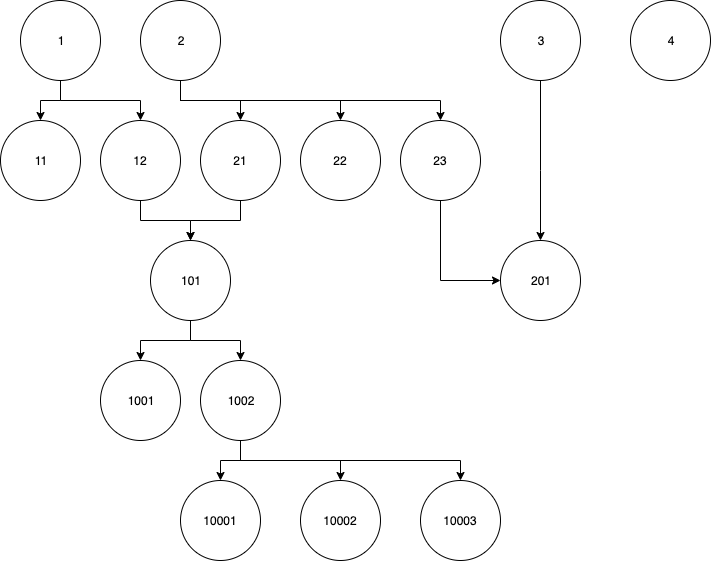

# macnificos-nuxt-demo

## Problem domain

We have an API endpoint that returns a one level JSON object where each property name is a category ID and, it stores an array of other category IDs. This array of category IDs are sub-categories.

So, if we recive a JSON like this from the API:

```json
{
    1: [11, 12],
    2: [21, 22, 23],
    3: [201],
    4: [],
    12: [101],
    21: [101],
    23: [201],
    101: [1001, 1002],
    1002: [10001, 10002, 10003]
}
```

We should build a categories tree like this:



## Information about the app generation wizard

We used the following command for generating the new app:

```bash
$ yarn create nuxt-app macnificos-nuxt-demo
```

Then, we chosen the following options from the command wizard:

```bash
create-nuxt-app v3.7.1
✨  Generating Nuxt.js project in macnificos-nuxt-demo
? Project name: macnificos-nuxt-demo
? Programming language: JavaScript
? Package manager: Yarn
? UI framework: Vuetify.js
? Nuxt.js modules: Axios - Promise based HTTP client, Progressive Web App (PWA)
? Linting tools: ESLint, StyleLint
? Testing framework: Jest
? Rendering mode: Universal (SSR / SSG)
? Deployment target: Server (Node.js hosting)
? Development tools: Dependabot (For auto-updating dependencies, GitHub only)
? Continuous integration: None
? What is your GitHub username? josepcrespo
? Version control system: Git
```

## Quick Start

1. Clone the project on your computer:

```bash
git clone https://github.com/josepcrespo/macnificos-nuxt-demo.git
```

2. Change to the new project directory:

```bash
cd macnificos-nuxt-demo
```

3. Build and, start the Docker environment

```bash
docker-compose build --no-cache --force-rm && docker-compose up
```

Wait until you can see "Listening on: http:// …" on the last line of the shell. Then you can open your favorite web browser at [http://localhost:3000/](http://localhost:3000/).

## Docker start

If you already built the Docker images, containers, volumes, network, etc, and only needs to start the enviroment:

```bash
docker-compose up
```

You will see something like this:

and you can interact with the app at [http://localhost:3000/](http://localhost:3000/)

## Local Setup

If you don't want a full Docker environment, here you have a list of commands for developing directly on your computer:

```bash
# install dependencies
$ yarn install

# serve with hot reload at localhost:3000
$ yarn dev

# build for production and launch server
$ yarn build
$ yarn start

# generate static project
$ yarn generate
```

For detailed explanation on how things work, check out the [documentation](https://nuxtjs.org).

## Special Directories

You can create the following extra directories, some of which have special behaviors. Only `pages` is required; you can delete them if you don't want to use their functionality.

### `assets`

The assets directory contains your uncompiled assets such as Stylus or Sass files, images, or fonts.

More information about the usage of this directory in [the documentation](https://nuxtjs.org/docs/2.x/directory-structure/assets).

### `components`

The components directory contains your Vue.js components. Components make up the different parts of your page and can be reused and imported into your pages, layouts and even other components.

More information about the usage of this directory in [the documentation](https://nuxtjs.org/docs/2.x/directory-structure/components).

### `layouts`

Layouts are a great help when you want to change the look and feel of your Nuxt app, whether you want to include a sidebar or have distinct layouts for mobile and desktop.

More information about the usage of this directory in [the documentation](https://nuxtjs.org/docs/2.x/directory-structure/layouts).


### `pages`

This directory contains your application views and routes. Nuxt will read all the `*.vue` files inside this directory and setup Vue Router automatically.

More information about the usage of this directory in [the documentation](https://nuxtjs.org/docs/2.x/get-started/routing).

### `plugins`

The plugins directory contains JavaScript plugins that you want to run before instantiating the root Vue.js Application. This is the place to add Vue plugins and to inject functions or constants. Every time you need to use `Vue.use()`, you should create a file in `plugins/` and add its path to plugins in `nuxt.config.js`.

More information about the usage of this directory in [the documentation](https://nuxtjs.org/docs/2.x/directory-structure/plugins).

### `static`

This directory contains your static files. Each file inside this directory is mapped to `/`.

Example: `/static/robots.txt` is mapped as `/robots.txt`.

More information about the usage of this directory in [the documentation](https://nuxtjs.org/docs/2.x/directory-structure/static).

### `store`

This directory contains your Vuex store files. Creating a file in this directory automatically activates Vuex.

More information about the usage of this directory in [the documentation](https://nuxtjs.org/docs/2.x/directory-structure/store).
